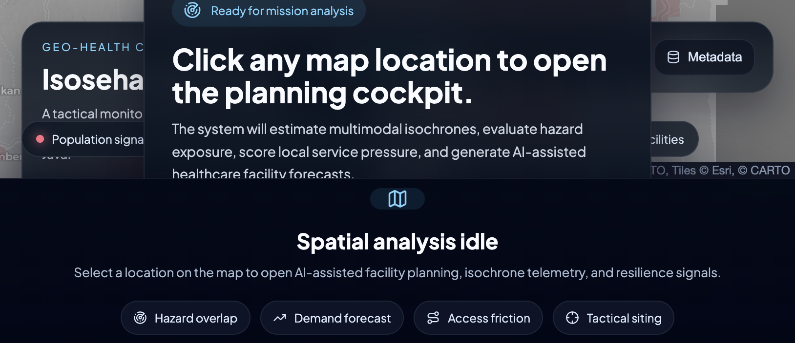
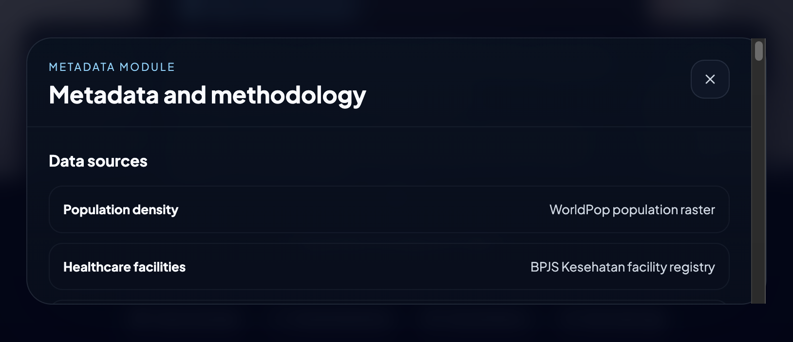

# 

> **Geospatial Intelligence for healthcare access, hazard resilience, and facility planning in East Java.**

[](https://isosehat-frontend-lmbh2nopoq-et.a.run.app)
[](https://isosehat-frontend-lmbh2nopoq-et.a.run.app)
[](https://isosehat-vertex-api-lmbh2nopoq-et.a.run.app/health)
[](./LICENSE)

[](./frontend)
[](./gcp/vertex-api)
[](./frontend/src/App.tsx)
[](./data)

Isosehat v3 is a map-first geospatial intelligence platform for **East Java, Indonesia**.  
It combines **real spatial datasets**, **local planning metrics**, and **Vertex AI Gemini** to answer a practical question:

**If a location is underserved, hazard-exposed, or hard to reach, what kind of healthcare intervention should happen there next?**

Instead of treating the map as decoration, Isosehat makes it the primary interface. Click a location and the app assembles population, hazard, facility, support network, and isochrone evidence into a planning-ready command panel.

This public repository is also prepared for the **Gen AI APAC Academy hackathon** context, where clarity, reproducibility, and public sharing matter.

## 🧩 Hackathon Problem Statement

This project is aligned with the **Gen AI APAC Academy** challenge:

**AI-Powered Decision Intelligence Platform**  
Build an AI-powered Decision Intelligence Platform that helps individuals, organizations, and communities analyze data, generate insights, predict outcomes, and make better decisions. The solution should transform structured and unstructured data into actionable intelligence through AI, analytics, and intelligent automation.

### Core requirements

- Ingest and analyze data from multiple sources
- Enable natural language interaction with data
- Generate insights, recommendations, forecasts, or alerts
- Identify patterns, trends, and anomalies
- Support decision-making through AI-powered assistance
- Deploy a scalable, real-world application using Google Cloud technologies

### Goal

Demonstrate how AI, data analytics, and intelligent automation can help create safer, healthier, more efficient, and more sustainable communities.

### Use case

**Healthcare & Community Well-being**  
Enhance healthcare access, wellness monitoring, and community support systems.

## ✅ Why Isosehat Is A Strong Fit

Isosehat directly addresses the challenge by turning geospatial health data into actionable decision intelligence:

- **Multiple data sources in one decision layer**
  - Population grids, healthcare facilities, hazard layers, support facilities, isochrone templates, and reverse geocoded administrative context are combined into one planning workflow.

- **Natural language interaction with evidence-backed context**
  - Vertex AI Gemini interprets structured geospatial signals and returns strategic insight in human-readable language.

- **Recommendations, forecasts, and alerts**
  - The platform produces coverage status, planning priorities, facility recommendations, forecast candidates, and resilience-oriented actions.

- **Pattern and anomaly detection through spatial reasoning**
  - Isosehat highlights underserved cells, hazard-stacked demand, weak referral access, and brittle service networks.

- **AI-assisted decision support**
  - It helps users make better healthcare infrastructure decisions, not just inspect maps.

- **Google Cloud-native deployment**
  - The application is deployed as a real, scalable solution on Google Cloud Run and uses Vertex AI Gemini for intelligence generation.

## ✨ Live Links

- **Frontend:** [isosehat-frontend](https://isosehat-frontend-lmbh2nopoq-et.a.run.app)
- **Backend API:** [isosehat-vertex-api](https://isosehat-vertex-api-lmbh2nopoq-et.a.run.app)
- **Health check:** [API health endpoint](https://isosehat-vertex-api-lmbh2nopoq-et.a.run.app/health)
- **Prototype inspiration:** [IsoSehat v2](https://isosehat.netlify.app/)

## ⚡ Quick Start

If you just want to run the project locally:

```bash
# terminal 1
cd frontend
npm install
npm run dev

# terminal 2
cd gcp/vertex-api
python3 -m venv .venv
source .venv/bin/activate
pip install -r requirements.txt
uvicorn main:app --reload --host 0.0.0.0 --port 8080
```

Then open:

- Frontend: `http://localhost:5173`
- Backend: `http://localhost:8080`

## 📸 Screenshots

| Overview | Metadata and methodology |
| --- | --- |
|  |  |
| Main operational map view with geospatial overlays, HUD panels, and command-deck layout. | Metadata popup showing sources, indicators, and analytical methodology used by the platform. |

## 🚀 Why Isosehat v3 Matters

- **Map-first, not dashboard-first**
  - The user explores territory directly and opens intelligence from the map itself.

- **AI that is grounded in evidence**
  - Gemini receives structured payloads: coordinates, hazards, nearby facilities, settlement profile, and geospatial metrics.

- **Planning-aware outputs**
  - The app does not stop at descriptive text. It returns coverage status, facility recommendations, forecast candidates, and priority actions.

- **Real East Java data**
  - The project uses actual population, hazard, boundary, healthcare, and support datasets from the repository.

- **Designed like an operations console**
  - The interface is intentionally dark, technical, and built like a command deck rather than a generic dashboard.

## 🧭 Core Capabilities

- **🧠 AI location intelligence**
  - Reverse geocoding via LocationIQ
  - Structured prompting to Vertex AI Gemini
  - Strategic summaries, planning signals, and priority actions

- **🏥 Coverage and service analysis**
  - Operational status: `covered`, `watch`, `gap`, `critical`
  - Nearby facility interpretation inside active isochrone reach
  - AI-refined assessment on top of local spatial scoring

- **📍 Planned facility forecasting**
  - Recommends **hospital**, **puskesmas**, or **clinic**
  - Ranks planning cells by urgency and priority score
  - Highlights candidate cells visually on the map

- **🟦 Initial healthcare density surface**
  - Preloads a healthcare chloropleth from aggregated facility counts
  - Makes dense facility clusters visible before any click analysis
  - Complements point-level inspection without flooding the map with markers

- **🌋 Hazard-aware health planning**
  - Earthquake exposure
  - Ground movement exposure
  - Hazard-adjusted demand logic
  - Resilience and access trade-off interpretation

- **🛰 Advanced geospatial signals**
  - Population density
  - Coverage confidence
  - Service pressure
  - Support readiness
  - Access friction
  - Resilience score
  - Forecast demand
  - Multimodal reach
  - Network redundancy
  - Referral pressure
  - Facility diversity
  - Hazard-adjusted demand

- **🗺 Terrain-aware map experience**
  - Dark basemap
  - Terrain-oriented basemap option
  - Driving and motorcycling isochrone overlays

## 🆚 Feature Comparison

| Capability | IsoSehat v2 prototype | Isosehat v3 |
| --- | --- | --- |
| Primary interaction model | Static dashboard + map support | Map-first command deck |
| AI-assisted analysis | No | Yes, via Vertex AI Gemini |
| Reverse geocoding | Limited / absent | Yes, via LocationIQ |
| Coverage status model | Basic | `covered`, `watch`, `gap`, `critical` |
| Planned facility recommendation | No | Yes |
| Hazard-aware planning | Partial | Yes, operationalized in scoring |
| Multimodal isochrone use | Basic visualization | Used in analytical scoring |
| Advanced geospatial metrics | Limited | Yes |
| Modern command UI | No | Yes |
| Cloud deployment | Prototype hosting | Cloud Run frontend + backend |

## 🧱 Tech Stack

| Layer | Stack |
| --- | --- |
| Frontend | React 18, TypeScript, Vite, Leaflet, React Leaflet, React Icons |
| Backend | FastAPI, Pydantic, Uvicorn |
| AI | Google Cloud Vertex AI, Gemini models |
| Spatial data | GeoJSON, CSV, shapefile-derived geometry |
| Geocoding | LocationIQ |
| Deployment | Google Cloud Run, Cloud Build, Docker |

## 🏗 Architecture

```text
                             ISOSEHAT v3 ARCHITECTURE

  +---------------------+         +------------------------------------------+
  |     User clicks     |         |     Static spatial data served by app    |
  |   an East Java map  |         |  boundary | areas | hazards | facilities |
  +----------+----------+         +-------------------+----------------------+
             |                                        |
             v                                        |
  +----------+----------------------------------------+----------+
  |                  React + Vite Frontend                       |
  |--------------------------------------------------------------|
  | - Leaflet map and overlays                                   |
  | - Geospatial scoring engine                                  |
  | - Coverage status inference                                  |
  | - Planned facility candidate ranking                         |
  | - AI insight panel and metadata popups                       |
  +----------+---------------------------+-----------------------+
             |                           |
             | reverse geocode           | structured analysis payload
             v                           v
  +----------------------+      +------------------------------------------+
  |      LocationIQ      |      |        FastAPI Vertex API backend        |
  | city / address /     |      |------------------------------------------|
  | state / country      |      | - request validation                     |
  +----------------------+      | - prompt construction                    |
                                | - response normalization                 |
                                | - fallback model / region selection      |
                                +-------------------+----------------------+
                                                    |
                                                    v
                                +------------------------------------------+
                                |          Vertex AI Gemini models         |
                                | strategic summary | planning insight     |
                                | coverage refine   | facility guidance    |
                                +-------------------+----------------------+
                                                    |
                                                    v
                                +------------------------------------------+
                                |  Command panel with final merged result  |
                                |  local metrics + AI interpretation       |
                                +------------------------------------------+
```

## 🧪 Data Sources

The project intentionally works with **real East Java datasets** and keeps the application UI in English.

| Domain | Source |
| --- | --- |
| Population density | WorldPop population grid |
| Healthcare facilities | BPJS Kesehatan facility registry |
| Earthquake hazard | Volcanology and Geological Hazard Mitigation Center, Ministry of Energy and Mineral Resources |
| Ground movement hazard | Volcanology and Geological Hazard Mitigation Center, Ministry of Energy and Mineral Resources |
| Supporting facilities | InaRisk, National Disaster Management Agency |
| Isochrone templates | OpenStreetMap-based routing exports |
| Administrative context | LocationIQ reverse geocoding |

## 📊 Analytical Model

Isosehat combines **deterministic geospatial scoring** with **AI interpretation**.

The local engine computes planning signals first. Gemini then explains, refines, and contextualizes those signals into a more readable strategic recommendation.

### Key indicators

| Indicator | What it means |
| --- | --- |
| Population density | Local demand intensity in people per square kilometer |
| Coverage confidence | Confidence that current nearby capacity is enough |
| Service pressure | Demand stress caused by density, low reach, and uncovered conditions |
| Hazard pressure | Disruption pressure from active hazard overlap |
| Support readiness | Operational readiness from support and nearby assets |
| Access friction | Difficulty reaching higher-order care, especially hospitals |
| Resilience score | Capacity to absorb shocks from hazard and access constraints |
| Forecast demand | Forward-looking urgency for additional service capacity |
| Multimodal reach | Whether different travel modes still maintain usable reach |
| Network redundancy | Presence of backup options if one facility fails or overloads |
| Referral pressure | Stress on escalation pathways toward hospital care |
| Facility diversity | How complete the local care mix is |
| Hazard-adjusted demand | Demand urgency after hazard and network weakness are accounted for |

### Coverage status model

Isosehat uses four operational states:

- `covered`
- `watch`
- `gap`
- `critical`

The frontend first infers this from local spatial evidence, and AI may refine the final interpretation before it is presented to the user.

### Facility recommendation model

Planned facilities are ranked using combined signals such as:

- population demand
- travel-time friction
- service gap conditions
- hazard burden
- settlement profile (`urban`, `peri-urban`, `rural`)
- referral pressure
- network redundancy

The output can recommend:

- **Hospital**
- **Puskesmas**
- **Clinic**
- **No new facility**

## 🗂 Repository Layout

```text
isosehat-v3/
├── data/                      # Raw East Java datasets
├── docs/
│   └── screenshots/           # README screenshots
├── frontend/
│   ├── public/data/           # Processed app-ready data
│   ├── scripts/               # Data build pipeline
│   └── src/                   # UI, logic, services, map layers
├── gcp/
│   ├── bq/                    # Optional BigQuery helpers and SQL
│   ├── geojson/               # GeoJSON exports and spatial assets
│   ├── policy_api/            # Policy helper API files
│   └── vertex-api/            # FastAPI service for Gemini on Vertex AI
└── prepare_for_bigquery.py    # Supporting preparation utility
```

## 🖥 Local Development

### Frontend

```bash
cd frontend
npm install
npm run dev
```

Default development URL:

- `http://localhost:5173`

### Backend

```bash
cd gcp/vertex-api
python3 -m venv .venv
source .venv/bin/activate
pip install -r requirements.txt
uvicorn main:app --reload --host 0.0.0.0 --port 8080
```

### Frontend environment variables

Create `frontend/.env` when needed:

```bash
VITE_API_BASE=http://localhost:8080
```

The frontend no longer stores geocoding secrets. Reverse geocoding is proxied through the backend.

### Backend environment variables

Typical variables for `gcp/vertex-api`:

```bash
PROJECT_ID=genai-apac-497712
REGION=asia-southeast2
VERTEX_MODEL=gemini-2.5-flash
VERTEX_FALLBACK_MODEL=gemini-1.5-flash-001
VERTEX_FALLBACK_REGION=us-central1
LOCATIONIQ_API_KEY=your_locationiq_key
```

For local development, this value can live in a local shell session or local `.env` workflow outside version control.  
For production on Cloud Run, prefer **Google Secret Manager** instead of plain environment variables.

## 🧠 Runtime Architecture Notes

- **BigQuery is not required at runtime for the live application.**
- The current production app uses:
  - static processed spatial files served by the frontend
  - a FastAPI backend for AI and reverse geocoding
  - Vertex AI Gemini for planning intelligence
- The `gcp/bq` directory remains useful as an optional data-engineering path for future scaling, warehousing, or scheduled preprocessing.

## 🔄 Rebuild Processed Data

When raw datasets change, regenerate app-ready files with:

```bash
python3 frontend/scripts/build_final_data.py
```

This refreshes `frontend/public/data/`, including:

- area tiles
- hazard layers
- facility layers
- boundary data
- metadata files
- isochrone templates

## ☁️ Deployment

### Frontend to Cloud Run

```bash
gcloud run deploy isosehat-frontend \
  --source ./frontend \
  --region asia-southeast2 \
  --platform managed \
  --allow-unauthenticated \
  --set-build-env-vars VITE_API_BASE=https://YOUR_BACKEND_URL
```

The current public frontend is deployed at:

- `https://isosehat-frontend-lmbh2nopoq-et.a.run.app`

### Vertex API to Cloud Run

The backend can be deployed from `gcp/vertex-api/` using the included `Dockerfile`.

The current public backend is deployed at:

- `https://isosehat-vertex-api-lmbh2nopoq-et.a.run.app`

### Production secret handling with Secret Manager

Recommended production flow:

```bash
# Create the secret once
printf '%s' 'YOUR_LOCATIONIQ_KEY' | \
  gcloud secrets create locationiq-api-key \
  --replication-policy=automatic \
  --data-file=-

# Allow the Cloud Run service account to read it
gcloud secrets add-iam-policy-binding locationiq-api-key \
  --member='serviceAccount:vertex-express@genai-apac-497712.iam.gserviceaccount.com' \
  --role='roles/secretmanager.secretAccessor'

# Bind the secret to the backend service
gcloud run services update isosehat-vertex-api \
  --platform managed \
  --region asia-southeast2 \
  --update-secrets LOCATIONIQ_API_KEY=locationiq-api-key:latest \
  --remove-env-vars LOCATIONIQ_API_KEY
```

## 🔐 Secrets and Safety

- Vertex AI credentials should remain on the backend.
- Frontend should only use public-safe variables such as API base URL.
- Geocoding keys such as `LOCATIONIQ_API_KEY` should stay on the backend and never be bundled into the browser.
- For production on Google Cloud, prefer **Secret Manager** over plain Cloud Run environment values for third-party API keys.
- The app should not expose service account credentials to the browser.

## 📌 Current Scope

- **Province focus:** East Java
- **Hazard scenarios:** Earthquake and ground movement
- **UI language:** English
- **Analysis language:** English

## 🎯 Project Intent

Isosehat v3 is the evolution of an earlier non-AI healthcare mapping prototype into a more operational planning system:

- from static dashboard -> to interactive map intelligence
- from simple overlays -> to grounded geospatial scoring
- from descriptive output -> to AI-assisted planning recommendations

Inspired by:

- [IsoSehat v2](https://isosehat.netlify.app/)

## 👨‍💻 Developer

Built by **Ryan W. Januardi**  
GitHub: [@kohryan](https://github.com/kohryan/)

## 🤝 Contributing

Ideas and contributions are especially welcome around:

- geospatial calibration
- facility optimization logic
- policy and citizen copilot modules
- accessibility modeling
- resilience planning methodology

## 🙏 Acknowledgments

- **Gen AI APAC Academy** for the hackathon context and challenge framing around AI-powered decision intelligence.
- The broader open geospatial and healthcare data ecosystem that makes public-interest planning tools like this possible.


## License

This project is released under the **MIT License**.  
See [LICENSE](./LICENSE) for the full text.
